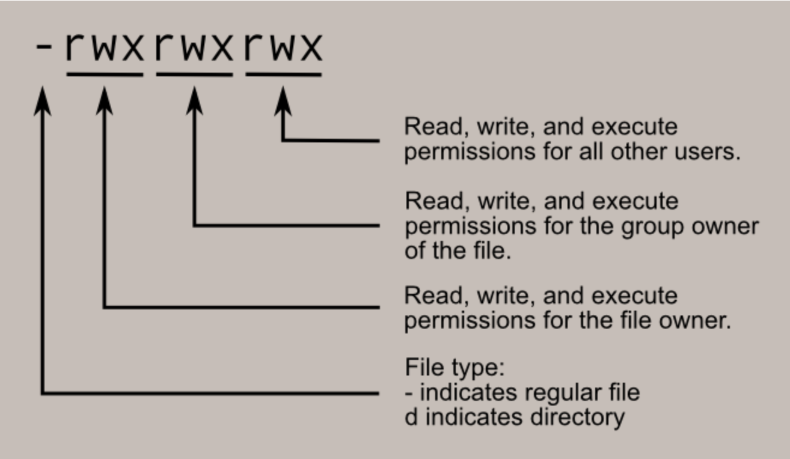

# Beginning bash
Bash is the most direct way to interact with your UNIX-based system. Both Linux and mac are based on unix, while windows is different and only recently allowed to have a unix-style terminal.

But what does this mean practically? It means that on all major 3 systems (see above), we can open up a terminal and execute commands that ---largely--- perform the same task without a graphical interface, which allows us to perform complex tasks natively without the use of commercial programs. The way we interact with this system is through a SHELL.

#### What is a shell?:
taken from the allmighty google:

<em>"A Shell provides you with an interface to the Unix system. It gathers input from you and executes programs based on that input. When a program finishes executing, it displays that program's output. Shell is an environment in which we can run our commands, programs, and shell scripts. There are different flavors of a shell, just as there are different flavors of operating systems. Each flavor of shell has its own set of recognized commands and functions."</em>

In research, most workstations and servers use Linux, so the terminal is an excellent way to use and navigate our computational facilities. This also means that you can easily communicate in between them (and your laptop) using the same language.

## Requirements

### Terminal interface
In order to interact with a terminal, you will need a terminal program. Linux and Mac have native terminal interfaces, although I highly recommend using iTerm2 on Mac instead of the native one.

For windows users, you will need to install the `Windows subbsystem for Linux`. Guide here online:

https://www.howtogeek.com/249966/how-to-install-and-use-the-linux-bash-shell-on-windows-10/


### Shell
In the following course, we will limit ourselves to a single shell: BASH. Other shells can be slightly different, but they will largely look and function similarly.

Let's begin by printing out what shell you are using and where it is installed:
```bash
$my_teminal$: echo $0
/usr/local/bin/bash
```

If you do not have BASH as a default shell, on Linux and Mac you can change it to that with:
```bash
$my_teminal$: chsh -s /bin/bash
```

On Windows subsystem for Linux, we are lucky that BASH is always the default :)

### Text editor
When programming, you will often need to open and edit ASCII text files that can have any, or no extension. There are many text editors out there, but I encourage you to learn `vim` as it is the most portable one.

`vim` does not use the mouse, making it not very intuitive. Here is a quick `vim` user guide:
```
vim myfile              # open the file from the terminal
<arrows, scrolling>     # moving around the text
:q                      # quit vim if there are no changes
:q!                     # quit vim without saving changes
i                       # enter "insert" mode to write/delete stuff
R                       # enter "replace" mode
x                       # delete a single character
esc                     # exit any mode (necessary to type other commands)
:w                      # save changes
:wq                     # save changes and quit vim
yy                      # copy (yank) the selected line
p                       # paste copied (yanked) line
```


# Basic bash usage
## Navigating the system
When you are opening your terminal, you are basically navigating the filesystem of your machine (i.e. your folders!). In order to do this you need to memorise some basic commands. Here we will go through some basic examples.

In bash (and in all shells), `#` indicates a comment, which is a line that will not be executed as a command in the shell.

In the following example, we are going to create a new directory, access it and create a new file inside it and manipulate it a bit. PLEASE NOTE THAT THE `rm` COMMAND IN SHELL REMOVES FILES AND FOLDERS FOREVER, it does NOT send them to the thrash first. I warned you.

First let's see where we are. By default, when you turn on your terminal you will be in your home folder.

```bash
$my_teminal$: pwd
home/my_user
```
Now we'll make a new directory (folder) and enter it
```bash
$my_teminal$: mkdir my_directory
$my_teminal$: cd my_directory
$my_teminal$: pwd
home/my_user/my_directory
```
Now we are going to create an empty file, list the contents of the directory then remove the new file
```bash
$my_teminal$: touch myfile
$my_teminal$: ls .
myfile
$my_teminal$: rm myfile
$my_teminal$: ls .
```
Now we are going to return to our home folder
```bash
$my_teminal$: cd ../
$my_teminal$: pwd
home/my_user
```
## Files, folders, variables
In any shell, you will encounter three different types of "objects", some of which we just encountered in the example above.

### Files:
these can be of all kind, but a file is a set of information stored on the computer. They can contain either data that we read or write, or sets of instructions (aka commands). The latter we call `programs`. All `programs` are written as sets of instructions in a file somewhere in your system.

An empty file can be created and deleted by typing:
```bash
$my_teminal$: touch myfile
$my_teminal$: rm myfile
```

### Folders:
easy enough, these are the way we organise our filesystem. An empty directory can be created and deleted by typing:
```bash
$my_teminal$: mkdir my_directory
$my_teminal$: rmdir my_directory
```

### Variables:
these can be numbers or text (strings) that we assign a name to. Once assigned, every time we call that name, it will return that input for us to do what we want with it. In shell, variables are denoted by the sign `$` before their name.

We can assign a variable and print it to the screen by typing:
```bash
$my_teminal$: var1="I am a string variable"
$my_teminal$: echo ${var1}
I am a string variable
```
Now whenever we call `${var1}`, we will get the string we assigned to it. For a number:
```bash
$my_teminal$: var1=1
$my_teminal$: var2=3.25
$my_teminal$: echo ${var1} ${var2}
1 3.25
```


## Writing a shell program
In the next example, we are going to write an extremely simple bash program and execute it. A bash (or shell) program is just a file in which we write down ("code") a set of commands just like the ones we performed in the previous examples.


First let's go back into our new directory and verify we are there
```bash
$my_teminal$: cd my_directory
$my_teminal$: pwd
/mnt/home_geo/my_user/my_directory
```

Now we are going to create an empty file that will be your shell program. We could call it however we want, but let's give it an extension name that will remind us it's a shell program:
```bash
$my_teminal$: touch myprogram.sh
```
...and open it, for instance, with `vim`:
```bash
$my_teminal$: vim myprogram.sh
```
In order to write the program, we will need to open a file and edit text in it. There are many editors that can do it. I personally use vim, but it has a steep learning curve. More beginner-friendly editors are for insance `gedit` or `sublime`. I will assume you will find the way you prefer to open a file and edit it.

Now we will add few lines into our file: The first line is called a `shebang` and it tells the system what programming language we are using; the following line tells the program to printout a message when executed.

```bash
#!/usr/bin/env bash

echo "if you see this, your first program is working!"
```

Now we can save the program and close the editor. After this we want to execute our program. To do so, we will first need to label this file as a program that can be executed: change the permissions and <em>make it executable</em>.

The permissions of a file can be seen by using the long-list command `ls -l`. For a random text file:
```bash
$my_teminal$: ls -l testfile.txt
-rw-r--r--  1 my_user  my_group     0B  9 Mar 16:55 testfile.txt
```
With the important line being `-rw-r--r--`, which means(taken from https://linuxcommand.org/lc3_lts0090.php):



\
Where a simple dash `-` means that is not permitted. As we can see from the example above, a newly generated file can be read by everyone but written (edited) only by the file owner/creator (you).

So now back to our newly written program that we need to make executable. First let's look at the file labels by long-listing the contents of the folder:
```bash
$my_teminal$: ls -l myprogram.sh
-rw-r--r--  1 my_user  staff    80B  7 Mar 15:29 myprogram.sh
```
We are using the program "chmod" (aka "change mode") with the option +x ("add execution possibility"):
```bash
$my_teminal$: chmod +x myprogram.sh
$my_teminal$: ls -l myprogram.sh
-rwxr-xr-x  1 my_user  staff    80B  7 Mar 15:29 myprogram.sh
```
Now let's run our program!
```bash
$my_teminal$: ./myprogram.sh
"if you see this, your first program is working!"
```
In the last command, you will notice we had to run our program preceding it with a `./`. This is because we need to tell exactly the system where the program is located. However, we run programs like `pwd`, `chmod`, `gedit`, `ls` without the full directory path to their code, right? The way to do this is to set up your own shell, and it is the topic of a later chapter of this course.

## Input, output and concatenating commands
In shell, most programs need an input and produce an output. These can be either printed to screen (standard in/out aka `stdin`, `stdout`) or redirected to a file.

Here we can for instance list the content of a directory with some files in it and write it to a new file using the operator `>`, then print to the screen (`stdout`) the content of the new file using `cat`:
```bash
$my_teminal$: ls my_directory > my_dirlist.txt
$my_teminal$: cat my_dirlist.txt
file1.txt
file2.txt
file3.txt
```

Similarly, we can take the output of a command and redirect the output as input for another command using the operator `|`, in this case `wc` (word count):
```bash
$my_teminal$: ls my_directory | wc
      3       3      30
```
Which lists the numer of lines, words and bytes of the list of directories.

Here another, more complex example:
```bash
$my_teminal$: echo "1 2 3" | awk '{print "sum of first two is:", $1+$2}'

sum of first two is: 3
```

What we did here is just print the numbers "1 2 3" as a text string and then redirect these as input for the program `awk`, that we used to parse the result, sum only the first two elements of the string and print the result with some text explanation.

If we wanted, we could append another `|` at the end and further manipulate the result of our `awk` command.

Output redirection becomes particularly useful when manipulating files. As we have shown, programs like `awk` can perform math, so they can be very useful to perform basic operations (or complex actually!) directly in bash:

At first, let's create a file `text.txt` with some numbers in two columns:
```bash
1 1
3 1
5 1
7 1
2 1
4 1
6 1
```

Now let's sort it and write the sum of the first and second column into a new file `results.txt`:
```bash
$my_teminal$: sort text.txt | awk '{print $1+$2}' > results.txt
```

We can now view the results in a lot of ways, but a quick way to do it is to to use the `cat` command we encountered before. `cat` will print the content of one or more files to the terminal:

```bash
$my_teminal$: cat results.txt
2
3
4
5
6
7
8
```


## Loops and conditions
Two of the main things that you'll see in programs are loops and conditions statements. These are statements that will repeat a command a number of times (loops) or execute it only if a condition is satisfied (conditional statements).

### Loops
Let's begin with loops. The idea is to repeat a set of commands either based on if a condition is true (while) or on the length of a list.

Since `1=1` is always true, the following code will run forever printing `"banana"` every 1 second
```bash
while [ 1==1 ]; do
    sleep 1
    echo "banana"
done
```

**Trick: one-line commands:** The example above is for writing the code in a program. You can also write the same code in the terminal directly, separating commands with `;` (note that there is no `;` after `do`):
```bash
$my_teminal$: while [ 1==1 ]; do sleep 1; echo "banana"; done
```
To `STOP` the loop, press `ctrl+c`.


The following code will increase the value of `${i}` and stop printing its value once the condition `i<=5`is not satisfied anymore:
```bash
i=0
while [ ${i} -le 5 ]; do   # le stands for "lower or equal"
    i=$((i+1))             # this increases i by one every loop iteration
    echo ${i}
done
```

The next code will instead loop over a set length and repeat a command:
```bash
for i in {0..10}; do
    echo ${i}
done
```

This can be used also with files; if I have a set of files file1.txt, file2.txt, file3.txt, I can perform any operation on each of them, for instance finding their absolute path:
```bash
for f in file*.txt; do
    realpath ${f}
done
```

### Conditions
These statements are traffic lights that allow us to decide whether a command in a program is executed or not based on fulfilling a condition.

For example, we can evolve a bit our finite loop from before:
```bash
i=0
while [ ${i} -le 100 ]; do
    ((i++))

    if [ ${i} -le 10 ]; then
        echo "${i} is lower equal 10"
    elif [ ${i} -gt 10 ]; then
        echo "${i} is greater than 10"
    fi

    if [ ${i} == 20 ]; then
        echo "we reached 20, break and exit the loop"
        break
    fi
done
```
In the example above, we put a set of conditions in the while loop, so that it outputs different text based on the value of `i`, with the last condition terminating the script when we reach `i=20`.

# Useful commands
Here a list of some of the most useful basic bash commands:
```bash
ls       #- list directory contents
pwd      #- print name of the current working directory
cat      #- send file content to screen
cd       #- change current directory
chmod    #- change file permissions
cp       #- copy files and directories
grep     #- print lines matching a pattern
less     #- quick view of a file as simple text
man      #- display on-line manual pages for individual commands
mkdir    #- make directories
mv       #- rename/move files
rm       #- remove files and directories
rmdir    #- remove empty directories
echo     #- write characters to the screen
sort     #- sort input
wc       #- line, word and byte count of file
head     #- print beginning of file
tail     #- print end of file
```

# Tricks
Here some VERY useful basic tricks to speed up your work (be more lazy):
```bash
tab        #- auto-complete, for files, variables and directories (TAB YOUR PATHS)
arrow up   #- scroll through previously executed commands
ctrl+r     #- begin writing after that to scroll through
           #  previous commands starting with those letters
history    #- prints to screen all commands recently executed
```
